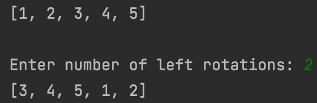
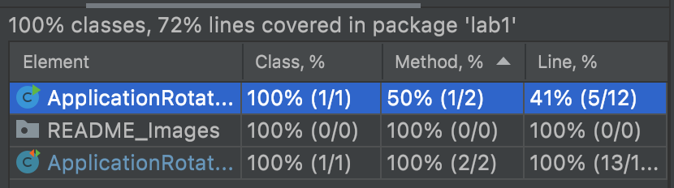

<h1 align="center">Program for Array Rotation</h1>

<h2>Scenario</h2>

- A left rotation operation on an array shifts each of the array's
  elements' to the left.

- Example input :.[1,2,3,4,5], shift 2 to the left. 

- Example output:[3,4,5,1,2]

**Below is the console interaction**

**Below is the coverage results**

  _Method and line coverage is not 100% because the main method is not covered in the test._
